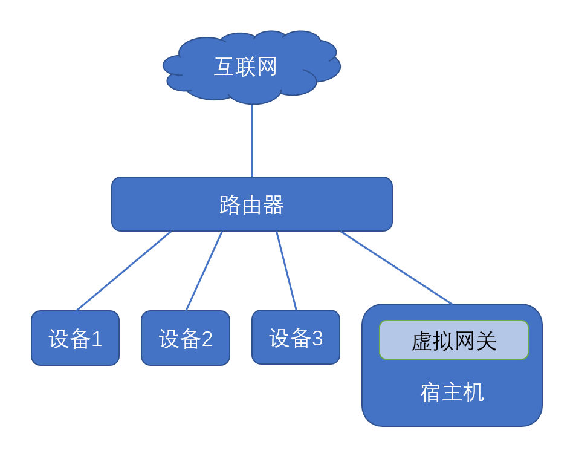

# XProxy

> 虚拟代理网关，对局域网设备进行透明代理

+ 基于容器运行，无需修改主机路由配置，开箱即用

+ 独立的MAC地址，与宿主机网络栈无耦合，随开随关

+ 允许自定义DNS、上游网关、IP地址等网络选项

+ 支持TCP、UDP流量代理，完整的Fullcone NAT支持

+ 完全兼容IPv6，支持SLAAC地址分配，RDNSS与DNSSL配置

+ （待支持）DHCP与DHCPv6地址自动分配

## 拓扑模型

XProxy部署在内网Linux主机上，通过 `macvlan` 网络创建独立MAC地址的虚拟网关，捕获内网设备的网络流量，对其进行透明代理；宿主机一般以单臂旁路由的方式接入，虚拟网关运行时不会干扰宿主机网络，且宿主机系统的流量也可被网关代理。



XProxy运行以后，内网流量将被收集到代理内核上，目前内置了 `xray` ，`v2ray` ，`sagray` 三种内核，支持 `Shadowsocks` ，`ShadowsocksR` ，`VMess` ，`VLESS` ，`Trojan` ，`WireGuard` ，`SSH` ，`PingTunnel` 等多种代理协议，支持 `XTLS` ，`WebSocket` ，`QUIC` ，`gRPC` 等多种传输方式。同时，得益于V2ray的路由设计基础，代理的网络流量可被精确地分流，可以依据内网设备、目标地址、访问端口、连接域名、流量类型等多种方式进行路由。

## 配置格式

XProxy支持YAML与JSON格式的配置文件，包含以下部分：

```yaml
proxy:
  ··· 代理选项 ···

network:
  ··· 网络选项 ···

update:
  ··· 路由资源 ···

custom:
  ··· 自定义脚本 ···

radvd:
  ··· IPv6路由广播 ···

```

### 代理选项

```yaml
# 以下配置仅为示范
proxy:
  log: info
  core: xray
  http:
    web: 8080
  socks:
    proxy: 1094
    direct: 1084
    proxy6: 1096
    direct6: 1086
  addon:
    - tag: metrics
      port: 9090
      protocol: dokodemo-door
      settings:
        address: 127.0.0.1
  sniff:
    enable: true
    redirect: false
    exclude:
      - Mijia Cloud
      - courier.push.apple.com
```

+ `log` ：代理日志级别，可选 `debug` 、`info` 、`warning` 、`error` 、`none` ，默认为 `warning` ；

+ `core` ：代理内核类型，可选 `xray` 、`v2ray` 、`sagray`，默认为 `xray` ；

+ `http` 与 `socks` ：配置 http 与 socks5 入站代理，使用 `key: value` 格式，前者指定入站标志（路由配置中的inboundTag），后者指定监听端口；

+ `addon` ：自定义入站选项，具体格式可见[内核文档](https://xtls.github.io/config/inbound.html#inboundobject)；

+ `sniff` ：嗅探选项，用于获取透明代理中的连接域名

    + `enable` ：是否启用嗅探功能，默认为 `false` ；

    + `redirect` ：是否使用嗅探结果覆盖目标地址，默认为 `false`（v2ray内核不支持）；

    + `exclude` ：不进行覆盖的域名列表（仅xray内核支持）；

### 网络选项

```yaml
# 以下配置仅为示范
network:
  dns:
    - 223.6.6.6
    - 119.29.29.29
  ipv4:
    gateway: 192.168.2.2
    address: 192.168.2.4/24
  ipv6:
    gateway: fc00::2
    address: fc00::4/64
  bypass:
    - 169.254.0.0/16
    - 224.0.0.0/3
    - fc00::/7
    - fe80::/10
    - ff00::/8
  exclude:
    - 192.168.2.2
    - 192.168.2.240/28
```

+ `dns` ：指定系统DNS服务器

+ `ipv4` 与 `ipv6` ：指定IPv4与IPv6的网络信息，其中 `gateway` 为上游网关地址，`address` 为虚拟网关地址（CIDR格式，包含子网长度）；

+ `bypass` ：绕过代理的目标网段或IP，建议绕过以下5个网段：

  + `169.254.0.0/16` ：IPv4链路本地地址

  + `224.0.0.0/3` ：D类多点播送地址，E类保留地址

  + `fc00::/7` ：IPv6唯一本地地址

  + `fe80::/10` ：IPv6链路本地地址

  + `ff00::/8` ：IPv6组播地址

+ `exclude` ：不代理的来源网段或IP；

+ > `bypass` 与 `exclude` 中指定的IP或CIDR，在运行时将不会被TProxy捕获，即不进入用户态的代理路由，相当于无损耗的直连；

### 路由资源

```yaml
# 以下配置仅为示范
update:
  cron: "0 0 4 * * *"  # 每日凌晨4点更新
  url:
    geoip.dat: "https://github.com/Loyalsoldier/v2ray-rules-dat/releases/latest/download/geoip.dat"
    geosite.dat: "https://github.com/Loyalsoldier/v2ray-rules-dat/releases/latest/download/geosite.dat"
```

+ `cron` ：触发更新的Cron表达式；

+ `url` ：更新的文件名及下载地址；

### 自定义脚本

```yaml
# 以下配置仅为示范
# fc00::4 tcp/53 & udp/53 <---> fc00::3 tcp/5353 & udp/5353
# 192.168.2.4 tcp/53 & udp/53 <---> 192.168.2.3 tcp/53 & udp/5353
custom:
  - "iptables -t nat -A PREROUTING -d 192.168.2.4 -p udp --dport 53 -j DNAT --to-destination 192.168.2.3:5353"
  - "iptables -t nat -A POSTROUTING -d 192.168.2.3 -p udp --dport 5353 -j SNAT --to 192.168.2.4"
  - "iptables -t nat -A PREROUTING -d 192.168.2.4 -p tcp --dport 53 -j DNAT --to-destination 192.168.2.3:5353"
  - "iptables -t nat -A POSTROUTING -d 192.168.2.3 -p tcp --dport 5353 -j SNAT --to 192.168.2.4"
  - "ip6tables -t nat -A PREROUTING -d fc00::4 -p udp --dport 53 -j DNAT --to-destination [fc00::3]:5353"
  - "ip6tables -t nat -A POSTROUTING -d fc00::3 -p udp --dport 5353 -j SNAT --to fc00::4"
  - "ip6tables -t nat -A PREROUTING -d fc00::4 -p tcp --dport 53 -j DNAT --to-destination [fc00::3]:5353"
  - "ip6tables -t nat -A POSTROUTING -d fc00::3 -p tcp --dport 5353 -j SNAT --to fc00::4"
```

自定义脚本命令，在启动代理前将依次执行；

### IPv6路由广播

```yaml
# 以下配置仅为示范
radvd:
  log: 3
  enable: true
  option:
    AdvSendAdvert: on
    AdvManagedFlag: off
    AdvOtherConfigFlag: off
  client:
    - fe80::215:5dff:feb1:df9b
    - fe80::21d:72ff:fe96:aaff
  prefix:
    cidr: fc00::/64
    option:
      AdvOnLink: on
      AdvAutonomous: on
      AdvRouterAddr: off
      AdvValidLifetime: 43200
      AdvPreferredLifetime: 7200
  route:
    cidr: ""
    option: null
  rdnss:
    ip:
      - fc00::3
      - fc00::4
    option: null
  dnssl:
    suffix:
      - scut.343.re
    option: null
```

`radvd` 有大量配置选项，`XProxy` 均对其保持兼容，以下仅介绍部分常用选项，更多详细参数可参考[man文档](https://www.systutorials.com/docs/linux/man/5-radvd.conf/)；

+ `log` ：RADVD日志级别，可选 `0-5`，数值越大越详细，默认为 `0`

+ `enable` ：是否启动RADVD，默认为 `false`

+ `option` ：RADVD主选项，即文档中 `INTERFACE SPECIFIC OPTIONS` 章节列出的配置：

  + `AdvSendAdvert` ：是否开启RA报文广播，启用IPv6时必须打开，默认为 `off`

  + `AdvManagedFlag` ：指示IPv6管理地址配置，即M位，默认为 `off`

  + `AdvOtherConfigFlag` ：指示IPv6其他有状态配置，即O位，默认为 `off`

  + > M位与O位的详细定义在[RFC4862](https://www.rfc-editor.org/rfc/rfc4862)中给出：

    + `M=off` 与 `O=off` ：使用 `Stateless` 模式，设备通过RA广播的前缀，配合 `EUI-64` 算法直接得到接口地址（即 `SLAAC` 方式）

    + `M=off` 与 `O=on` ：使用 `Stateless DHCPv6` 模式，设备通过RA广播前缀与 `EUI-64` 计算接口地址，同时从 `DHCPv6` 获取DNS等其他配置

    + `M=on` 与 `O=on` ：使用 `Stateful DHCPv6` 模式，设备通过 `DHCPv6` 获取地址以及DNS等其他配置

    + `M=on` 与 `O=off` ：理论上不存在此配置

  + `client` ：配置此项后，仅发送RA通告到指定IPv6单播地址而非组播地址，默认为空（组播发送）

  + `prefix` ：IPv6地址前缀配置，`cidr` 指定分配的前缀及掩码长度，`option` 指定前缀选项，即文档中 `PREFIX SPECIFIC OPTIONS` 章节列出的选项

  + `route` ：IPv6路由定义，`cidr` 指定通告的路由CIDR（注意客户端仅将RA报文来源链路地址设置为IPv6网关，此处设置并不能更改路由网关地址），`option` 指定路由选项，即文档中 `ROUTE SPECIFIC OPTIONS` 章节列出的选项

  + `rdnss` ：递归DNS服务器地址，`ip` 指定IPv6下的DNS服务器列表，`option` 即 `RDNSS SPECIFIC OPTIONS` 章节列出的选项

  + `dnssl` ：DNS搜寻域名，`suffix` 指定DNS解析的搜寻后缀列表，`option` 即 `DNSSL SPECIFIC OPTIONS` 章节列出的选项

  + > `rdnss` 与 `dnssl` 在[RFC6106](https://www.rfc-editor.org/rfc/rfc6106)中定义，将DNS配置信息直接放置在RA报文中发送，使用 `SLAAC` 时无需 `DHCPv6` 即可获取DNS服务器，但是旧版本Windows与Android等不支持该功能。

## 部署流程

### 1. 初始配置

```
# 开启网卡混杂模式
shell> ip link set eth0 promisc on

# 启用IPv6内核模块
shell> modprobe ip6table_filter
```

在 Docker 中创建 macvlan 网络

```
# 网段与网关信息按实际网络指定
shell> docker network create -d macvlan \
  --subnet=192.168.2.0/24 \
  --gateway=192.168.2.1 \
  --subnet=fc00::/64 \
  --gateway=fc00::1 \
  --ipv6 -o parent=eth0 macvlan  # 此处指定eth0网卡，需按实际调整
```

### 2. 开始部署

> 本项目基于Docker构建，在 [Docker Hub](https://hub.docker.com/repository/docker/dnomd343/xproxy) 或 [Github Package](https://github.com/dnomd343/XProxy/pkgs/container/xproxy) 可以查看已构建的各版本镜像。

`XProxy` 同时发布在多个镜像源上（国内网络可首选阿里云仓库）：

+ `Docker Hub` ：`dnomd343/xproxy`

+ `Github Package` ：`ghcr.io/dnomd343/xproxy`

+ `阿里云镜像` ：`registry.cn-shenzhen.aliyuncs.com/dnomd343/xproxy`

> 下述命令中，容器路径可替换为上述其他源

使用以下命令启动虚拟网关，配置文件将存储在本机 `/etc/xproxy/` 目录下：

```
shell> docker run --restart always \
  --privileged --network macvlan -dt \
  --name xproxy --hostname xproxy \  # 可选，指定容器名称与主机名
  --volume /etc/xproxy/:/xproxy/ \
  --volume /etc/timezone:/etc/timezone:ro \  # 以下两句可选，用于映射宿主机时区信息（容器内默认为UTC0时区）
  --volume /etc/localtime:/etc/localtime:ro \
  dnomd343/xproxy:latest
```

成功运行以后，存储目录将生成以下文件夹

+ `assets`：存储路由资源文件

+ `config`：存储代理配置文件

+ `log`：存储日志文件

**路由资源文件夹**

`assets` 目录默认放置 `geoip.dat` 与 `geosite.dat` 路由规则文件，分别存储IP与域名归属信息，在 `update` 中配置的自动更新将保存到此处；本目录亦可放置自定义规则文件，在代理[路由配置](https://xtls.github.io/config/routing.html#ruleobject)中以 `ext:${FILE}:tag` 格式引用。

**代理配置文件夹**

`config` 目录存储代理配置文件，所有 `.json` 后缀文件均会被载入，用户可配置除 `inbounds` 与 `log` 以外的所有代理选项，多配置文件需要注意[合并规则](https://xtls.github.io/config/features/multiple.html#%E8%A7%84%E5%88%99%E8%AF%B4%E6%98%8E)；

为了正常工作，容器初始化时会载入以下 `outbounds.json` 的默认出站配置，其指定所有流量为直连：

```
{
  "outbounds": [
    {
      "protocol": "freedom",
      "settings": {}
    }
  ]
}
```

**日志文件夹**

`log` 目录用于放置日志文件

+ 代理流量将记录到 `access.log` 和 `error.log` 中，前者存储访问日志，后者存储错误日志；

+ 若启用RADVD功能，其日志将保存到 `radvd.log` 中；

### 3. 调整配置文件

容器首次初始化时将生成默认配置文件 `xproxy.yml` ，其内容如下：

```yaml
# default configure file for xproxy
proxy:
  core: xray
  log: warning

network:
  bypass:
    - 169.254.0.0/16
    - 224.0.0.0/3
    - fc00::/7
    - fe80::/10
    - ff00::/8

update:
  cron: "0 0 4 * * *"
  url:
    geoip.dat: "https://github.com/Loyalsoldier/v2ray-rules-dat/releases/latest/download/geoip.dat"
    geosite.dat: "https://github.com/Loyalsoldier/v2ray-rules-dat/releases/latest/download/geosite.dat"
```

用户需要根据实际需求更改配置文件，保存以后重启容器即可生效：

```
shell> docker restart xproxy
```

如果配置文件出错，`XProxy` 将无法正常工作，您可以使用以下命令查看工作日志：

```
shell> docker logs -f xproxy
```

### 4. 宿主机访问虚拟网关

> 这一步旨在让宿主机能够使用虚拟网关，若无此需求可以跳过

由于macvlan方式的限制，宿主机上开启macvlan的网卡无法直接与虚拟网关通讯，需要另外配置网桥才可连接，

> 以下为配置基于Debian发行版，RH系或Arch系等的配置略有不同

```
# 编辑网卡配置文件
shell> vim /etc/network/interfaces
```

补充如下配置

```
# 具体网络信息需要按实际情况指定
auto eth0
iface eth0 inet manual

auto macvlan
iface macvlan inet static
  address 192.168.2.34   # 宿主机静态IP地址
  netmask 255.255.255.0  # 子网掩码
  gateway 192.168.2.2    # 虚拟网关IP地址
  dns-nameservers 192.168.2.3  # DNS主服务器
  dns-nameservers 192.168.2.1  # DNS备用服务器
  pre-up ip link add macvlan link eth0 type macvlan mode bridge  # 宿主机网卡上创建网桥
  post-down ip link del macvlan link eth0 type macvlan mode bridge  # 退出时删除网桥
```

重启宿主机网络生效，或直接重启宿主机系统：

```
shell> /etc/init.d/networking restart
[ ok ] Restarting networking (via systemctl): networking.service.
```

### 5. 局域网设备访问

配置完成后，容器IP为虚拟旁路由网关地址，设备网关设置为该地址即可正常上网。

对于非静态IP地址设备（常见情况）有以下情形：

+ 在IPv4上，修改路由器DHCP设置，将网关指向容器IP即可全局生效

+ 在IPv6上，容器默认会启动IPv6路由组播机制，内网设备将会无状态配置子网地址，网关地址自动指向容器链路本地地址，该配置可全局生效（需关闭路由器IPv6分配，避免冲突）

对于静态IP地址设备（非常见情况）有以下情形：

+ 在IPv4上，修改设备网关为容器IPv4地址

+ 在IPv6上，修改设备地址至容器指定子网内，网关地址配置为容器IPv6地址（非链路本地地址）

综上，开启虚拟网关前需关闭路由器IPv6地址分配，而后连入设备将自动适配IPv4与IPv6网络（绝大多数设备均以DHCP与IPv6路由器发现机制联网），对于此前在内网固定IP地址的设备，手动为其配置网关地址即可。

## 演示实例

实例1. 利用校园网53端口漏洞，使用XProxy搭建免费网络

实例2. 家庭网络IPv4与IPv6的透明代理

## 开发相关

## 许可证
