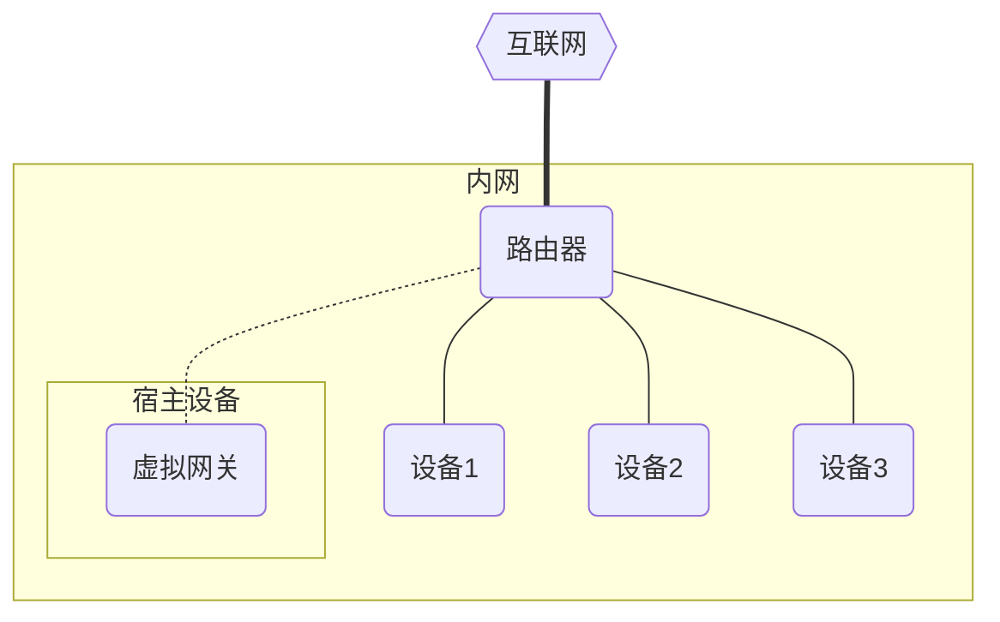

# XProxy

> 虚拟代理网关，对局域网设备进行透明代理

+ ✅ 基于容器运行，无需修改主机路由配置，开箱即用

+ ✅ 独立的 MAC 地址，与宿主机网络栈无耦合，随开随关

+ ✅ 允许自定义 DNS 、上游网关、IP 地址等网络选项

+ ✅ 支持 TCP 、UDP 流量代理，完整的 Fullcone NAT 支持

+ ✅ 完全兼容 IPv6 ，支持 SLAAC 地址分配，RDNSS 与 DNSSL 配置

+ ✅ 内置 DHCP 与 DHCPv6 服务器，支持 IP 地址自动分配

## 拓扑模型

XProxy 部署在内网 Linux 主机上，通过 `macvlan` 网络创建独立 MAC 地址的虚拟网关，劫持内网设备的网络流量进行透明代理；宿主机一般以单臂旁路由的方式接入，虚拟网关运行时不会干扰宿主机网络，同时宿主机系统的流量也可被网关代理。



XProxy 运行以后，内网流量将被收集到代理内核上，支持 `xray` ，`v2ray` ，`sagray` 等多种内核，支持 `Shadowsocks` ，`ShadowsocksR` ，`VMess` ，`VLESS` ，`Trojan` ，`WireGuard` ，`SSH` ，`PingTunnel` 等多种代理协议，支持 `XTLS` ，`WebSocket` ，`QUIC` ，`gRPC` 等多种传输方式。同时，得益于 V2ray 的路由设计，代理的网络流量可被精确地分流，可以依据内网设备、目标地址、访问端口、连接域名、流量类型等多种方式进行路由。

由于 XProxy 与宿主机网络完全解耦，一台主机上可运行多个虚拟网关，它们拥有不同的 MAC 地址，在网络模型上是多台独立的主机；因此各个虚拟网关能负责不同的功能，甚至它们之间还能互为上下级路由的关系，灵活实现多种网络功能。

## 配置格式

> XProxy 支持 JSON , YAML 与 TOML 格式的配置文件，其中 `.json` 与 `.toml` 后缀的文件分别以 JSON 与 TOML 格式解析，其余将以 YAML 格式解析

XProxy 的配置文件包含以下部分：

```yaml
proxy:
  ··· 代理选项 ···

network:
  ··· 网络选项 ···

asset:
  ··· 路由资源 ···

custom:
  ··· 自定义脚本 ···

radvd:
  ··· IPv6路由广播 ···

dhcp:
  ··· DHCP服务选项 ···

```

### 代理选项

```yaml
# 以下配置仅为示范
proxy:
  bin: xray
  log: info
  http:
    web: 8080
  socks:
    proxy4: 1094
    direct4: 1084
    proxy6: 1096
    direct6: 1086
  addon:
    - tag: metrics
      port: 9090
      protocol: dokodemo-door
      settings:
        address: 127.0.0.1
  sniff:
    enable: true
    redirect: false
    exclude:
      - Mijia Cloud
      - courier.push.apple.com
```

> 入站代理中内置 `tproxy4` 与 `tproxy6` 两个接口，分别对应 IPv4 与 IPv6 的透明代理，可作为 `inboundTag` 在路由中引用

+ `bin` ：指定内核名称，默认为 `xray`

> 自 `1.0.2` 起，XProxy 镜像仅自带 `xray` 内核，其他内核需要用户自行添加

> 例：在 Docker 启动命令中加入 `-v {V2RAY_BIN}:/usr/bin/v2ray` 可以将 `v2ray` 内核添加到容器中，在 `bin` 选项中指定内核名称即可生效，或者使用 `PROXY_BIN=v2ray` 环境变量指定。

+ `log` ：代理日志级别，可选 `debug` 、`info` 、`warning` 、`error` 、`none` ，默认为 `warning`

+ `http` 与 `socks` ：配置 http 与 socks5 入站代理，使用 `key: value` 格式，前者指定入站标志（路由配置中的 inboundTag），后者指定监听端口，默认为空

+ `addon` ：自定义入站配置，每一项为单个内核 inbound 接口，具体格式可见[内核文档](https://xtls.github.io/config/inbound.html#inboundobject)，默认为空

+ `sniff` ：嗅探选项，用于获取透明代理中的连接域名：

    + `enable` ：是否启用嗅探功能，默认为 `false`

    + `redirect` ：是否使用嗅探结果覆盖目标地址，默认为 `false`（v2ray 内核不支持）

    + `exclude` ：不进行覆盖的域名列表，默认为空（仅 xray 内核支持）

### 网络选项

```yaml
# 以下配置仅为示范
network:
  dev: eth0
  dns:
    - 223.6.6.6
    - 119.29.29.29
  ipv4:
    gateway: 192.168.2.2
    address: 192.168.2.4/24
  ipv6:
    gateway: fc00::2
    address: fc00::4/64
  bypass:
    - 169.254.0.0/16
    - 224.0.0.0/3
    - fc00::/7
    - fe80::/10
    - ff00::/8
  exclude:
    - 192.168.2.2
    - 192.168.2.240/28
```

+ `dev` ：指定运行的网卡，一般与物理网卡同名，默认为空

+ `dns` ：指定系统默认 DNS 服务器，留空时保持原配置不变，默认为空

+ `ipv4` 与 `ipv6` ：指定 IPv4 与 IPv6 的网络信息，其中 `gateway` 为上游网关地址，`address` 为虚拟网关地址（CIDR 格式，包含子网长度），不填写时保持不变，默认为空

+ `bypass` ：绕过代理的目标网段或 IP，默认为空，建议绕过以下5个网段：

  + `169.254.0.0/16` ：IPv4 链路本地地址

  + `224.0.0.0/3` ：D类多点播送地址，E类保留地址

  + `fc00::/7` ：IPv6 唯一本地地址

  + `fe80::/10` ：IPv6 链路本地地址

  + `ff00::/8` ：IPv6 组播地址

+ `exclude` ：不代理的来源网段或 IP

> `bypass` 与 `exclude` 中指定的 IP 或 CIDR，在运行时将不会被 TProxy 捕获，即不进入用户态的代理路由，相当于无损耗的直连

### 路由资源

```yaml
# 以下配置仅为示范
asset:
  disable: false
  update:
    cron: "0 5 6 * * *"  # 每天凌晨06点05分更新
    proxy: "socks5://192.168.2.4:1080"  # 通过 socks5 代理更新资源
    url:
      geoip.dat: "https://github.com/Loyalsoldier/v2ray-rules-dat/releases/latest/download/geoip.dat"
      geosite.dat: "https://github.com/Loyalsoldier/v2ray-rules-dat/releases/latest/download/geosite.dat"
```

+ `disable` ：是否关闭路由资源文件载入，默认为 `false`

+ `cron` ：触发更新的 Cron 表达式，留空时关闭自动升级，默认为空

+ `proxy` ：通过指定的代理服务更新资源文件，留空时直连更新，默认为空

+ `url` ：更新的文件名及下载地址，文件保存至 `assets` 中，默认为空

### 自定义脚本

```yaml
# 以下配置仅为示范
# fc00::4 tcp/53 & udp/53 <---> fc00::3 tcp/5353 & udp/5353
# 192.168.2.4 tcp/53 & udp/53 <---> 192.168.2.3 tcp/53 & udp/5353
custom:
  pre:
    - "iptables -t nat -A PREROUTING -d 192.168.2.4 -p udp --dport 53 -j DNAT --to-destination 192.168.2.3:5353"
    - "iptables -t nat -A POSTROUTING -d 192.168.2.3 -p udp --dport 5353 -j SNAT --to 192.168.2.4"
    - "iptables -t nat -A PREROUTING -d 192.168.2.4 -p tcp --dport 53 -j DNAT --to-destination 192.168.2.3:5353"
    - "iptables -t nat -A POSTROUTING -d 192.168.2.3 -p tcp --dport 5353 -j SNAT --to 192.168.2.4"
    - "ip6tables -t nat -A PREROUTING -d fc00::4 -p udp --dport 53 -j DNAT --to-destination [fc00::3]:5353"
    - "ip6tables -t nat -A POSTROUTING -d fc00::3 -p udp --dport 5353 -j SNAT --to fc00::4"
    - "ip6tables -t nat -A PREROUTING -d fc00::4 -p tcp --dport 53 -j DNAT --to-destination [fc00::3]:5353"
    - "ip6tables -t nat -A POSTROUTING -d fc00::3 -p tcp --dport 5353 -j SNAT --to fc00::4"
  post:
    - "echo Here is post process"
    - "echo Goodbye"
```

> 本功能用于注入自定义功能，基于 Alpine 的 ash 执行，可能不支持部分 bash 语法

+ `pre` ：自定义脚本命令，在代理启动前执行，默认为空

+ `post` ：自定义脚本命令，在服务关闭前执行，默认为空

### IPv6路由广播

> `radvd` 有大量配置选项，`XProxy` 均对其保持兼容，以下仅介绍部分常用选项，更多详细参数可参考[man文档](https://www.systutorials.com/docs/linux/man/5-radvd.conf/)

> 注意以下的 `on` 与 `off` 为字符串，但在部分 YAML 库中可能被解析成布尔值，为了安全起见，下游项目请注意转换时添加引号限定

```yaml
# 以下配置仅为示范
radvd:
  log: 3
  dev: eth0
  enable: true
  option:
    AdvSendAdvert: on
    AdvManagedFlag: off
    AdvOtherConfigFlag: off
  client:
    - fe80::215:5dff:feb1:df9b
    - fe80::21d:72ff:fe96:aaff
  prefix:
    cidr: fc00::/64
    option:
      AdvOnLink: on
      AdvAutonomous: on
      AdvRouterAddr: off
      AdvValidLifetime: 43200
      AdvPreferredLifetime: 7200
  route:
    cidr: ""
    option: null
  rdnss:
    ip:
      - fc00::3
      - fc00::4
    option: null
  dnssl:
    suffix:
      - scut.343.re
    option: null
```

+ `log` ：RADVD 日志级别，可选 `0-5`，数值越大越详细，默认为 `0`

+ `dev` ：执行 RA 广播的网卡，`enable` 为 `true` 时必选，一般与 `network` 中配置相同，默认为空

+ `enable` ：是否启动 RADVD，默认为 `false`

+ `option` ：RADVD 主选项，完整参数列表查看[这里](https://code.tools/man/5/radvd.conf/#lbAD)：

  + `AdvSendAdvert` ：是否开启 RA 报文广播，启用 IPv6 时必须打开，默认为 `off`

  + `AdvManagedFlag` ：指示 IPv6 管理地址配置，即 M 位，默认为 `off`

  + `AdvOtherConfigFlag` ：指示 IPv6 其他有状态配置，即 O 位，默认为 `off`

  + > M 位和 O 位的详细定义在 [RFC4862](https://www.rfc-editor.org/rfc/rfc4862) 中给出：

    + `M=off` 且 `O=off` ：使用 `Stateless` 模式，设备通过 RA 广播的前缀，配合 `EUI-64` 算法直接得到接口地址，即 `SLAAC` 方式

    + `M=off` 且 `O=on` ：使用 `Stateless DHCPv6` 模式，设备通过 RA 广播前缀与 `EUI-64` 计算接口地址，同时从 `DHCPv6` 获取 DNS 等其他配置

    + `M=on` 且 `O=on` ：使用 `Stateful DHCPv6` 模式，设备通过 `DHCPv6` 获取地址以及 DNS 等其他配置

    + `M=on` 且 `O=off` ：理论上不存在此配置

  + `client` ：配置此项后，仅发送 RA 通告到指定 IPv6 单播地址而非组播地址，默认为空（组播发送）

  + `prefix` ：IPv6 地址前缀配置，`cidr` 指定分配的前缀及掩码长度，`option` 指定[前缀选项](https://code.tools/man/5/radvd.conf/#lbAE)

  + `route` ：指定 IPv6 路由，`cidr` 为通告的路由 CIDR（注意客户端仅将 RA 报文来源链路地址设置为 IPv6 网关，此处设置并不能更改路由网关地址），`option` 指定[路由选项](https://code.tools/man/5/radvd.conf/#lbAF)

  + `rdnss` ：递归 DNS 服务器地址，`ip` 指定 IPv6 下的 DNS 服务器列表，`option` 指定[RDNSS选项](https://code.tools/man/5/radvd.conf/#lbAG)

  + `dnssl` ：DNS 搜寻域名，`suffix` 指定 DNS 解析的搜寻后缀列表，`option` 指定[DNSSL选项](https://code.tools/man/5/radvd.conf/#lbAH)

> `RDNSS` 与 `DNSSL` 在 [RFC6106](https://www.rfc-editor.org/rfc/rfc6106) 中定义，将 DNS 配置信息直接放置在 RA 报文中发送，使用 `SLAAC` 时无需 `DHCPv6` 即可获取 DNS 服务器，但旧版本 Windows 与 Android 等系统不支持该功能。

### DHCP服务选项

> DHCP 与 DHCPv6 功能由 [ISC-DHCP](https://www.isc.org/dhcp/) 项目提供

```yaml
# 以下配置仅为示范
dhcp:
  ipv4:
    enable: false
    config: |
      default-lease-time 600;
      max-lease-time 7200;

      subnet 192.168.2.0 netmask 255.255.255.0 {
        range 192.168.2.100 192.168.2.200;
      }

      host example {
        hardware ethernet 03:48:c0:5d:bd:95;
        fixed-address 192.168.2.233;
      }
  ipv6:
    enable: false
    config: |
      ...
```

+ `ipv4` 和 `ipv6` ：分别配置 DHCPv4 与 DHCPv6 服务

+ `enable` ：是否启动 DHCP 服务，默认为 `false`

+ `config` ：DHCP 服务配置文件，具体配置内容参考 [man文档](https://linux.die.net/man/5/dhcpd.conf)

## 部署流程

### 1. 初始配置

> XProxy 基于 macvlan 网络，开启网卡混杂模式后可以捕获非本机 MAC 地址的数据包，以此模拟出不同 MAC 地址的网卡

```
# 开启混杂模式，网卡按实际情况指定
shell> ip link set eth0 promisc on

# 启用IPv6内核模块
shell> modprobe ip6table_filter
```

在 Docker 中创建 macvlan 网络

```
# 网络配置按实际情况指定
shell> docker network create -d macvlan \
  --subnet={IPv4网段} --gateway={IPv4网关} \
  --subnet={IPv6网段} --gateway={IPv6网关} \
  --ipv6 -o parent=eth0 macvlan  # 在eth0网卡上运行
```

### 2. 开始部署

> 本项目基于 Docker 构建，在 [Docker Hub](https://hub.docker.com/repository/docker/dnomd343/xproxy) 或 [Github Package](https://github.com/dnomd343/XProxy/pkgs/container/xproxy) 可以查看已构建的各版本镜像。

XProxy 同时发布在多个镜像源上：

+ `Docker Hub` ：`dnomd343/xproxy`

+ `Github Package` ：`ghcr.io/dnomd343/xproxy`

+ `阿里云镜像` ：`registry.cn-shenzhen.aliyuncs.com/dnomd343/xproxy`

> 下述命令中，容器路径可替换为上述其他源，国内网络建议首选阿里云仓库

使用以下命令启动虚拟网关，配置文件将存储在本机 `/etc/xproxy/` 目录下：

```
shell> docker run --restart always \
  --privileged --network macvlan -dt \
  --name xproxy --hostname xproxy \  # 可选，指定容器名称与主机名
  --volume /etc/xproxy/:/xproxy/ \
  --volume /etc/timezone:/etc/timezone:ro \  # 以下两句可选，用于映射宿主机时区信息（容器内默认为UTC0时区）
  --volume /etc/localtime:/etc/localtime:ro \
  dnomd343/xproxy:latest
```

成功运行以后，存储目录将生成以下文件夹：

+ `assets` ：存储路由资源文件

+ `config` ：存储代理配置文件

+ `log` ：存储日志文件

+ `dhcp` ：存储 DHCP 数据库文件（仅当 DHCP 服务开启）

**路由资源文件夹**

`assets` 目录默认放置 `geoip.dat` 与 `geosite.dat` 路由规则文件，分别存储IP与域名归属信息，在 `update` 中配置的自动更新将保存到此处；本目录亦可放置自定义规则文件，在[路由配置](https://xtls.github.io/config/routing.html#ruleobject)中以 `ext:${FILE}:tag` 格式引用。

**代理配置文件夹**

`config` 目录存储代理配置文件，所有 `.json` 后缀文件均会被载入，用户可配置除 `inbounds` 与 `log` 以外的所有代理选项，多配置文件需要注意[合并规则](https://xtls.github.io/config/features/multiple.html#%E8%A7%84%E5%88%99%E8%AF%B4%E6%98%8E)。

为了正常工作，容器初始化时会载入以下 `outbounds.json` 作为默认出站配置，其指定所有流量为直连：

```
{
  "outbounds": [
    {
      "protocol": "freedom",
      "settings": {}
    }
  ]
}
```

**日志文件夹**

`log` 目录用于放置日志文件

+ `xproxy.log` 记录 XProxy 工作信息

+ `access.log` 记录代理流量连接信息

+ `error.log` 记录代理连接错误信息

+ 若启用RADVD功能，其日志将保存到 `radvd.log` 中

### 3. 调整配置文件

容器首次初始化时将生成默认配置文件 `xproxy.yml` ，其内容如下：

```yaml
# default configure file for xproxy
proxy:
  core: xray
  log: warning

network:
  bypass:
    - 169.254.0.0/16
    - 224.0.0.0/3
    - fc00::/7
    - fe80::/10
    - ff00::/8

asset:
  update:
    cron: "0 5 6 * * *"
    url:
      geoip.dat: "https://github.com/Loyalsoldier/v2ray-rules-dat/releases/latest/download/geoip.dat"
      geosite.dat: "https://github.com/Loyalsoldier/v2ray-rules-dat/releases/latest/download/geosite.dat"
```

用户需要根据实际需求更改配置文件，保存以后重启容器即可生效：

```
shell> docker restart xproxy
```

如果配置文件出错，`XProxy` 将无法正常工作，您可以使用以下命令查看工作日志：

```
shell> docker logs -f xproxy
```

### 4. 宿主机访问虚拟网关

> 这一步旨在让宿主机能够使用虚拟网关，若无此需求可以跳过

由于 macvlan 限制，宿主机网卡无法直接与虚拟网关通讯，需要另外配置网桥才可连接

> 以下为配置基于 Debian，基于 RH、Arch 等的发行版配置略有不同

编辑网卡配置文件

```
shell> vim /etc/network/interfaces
```

补充如下配置，具体网络信息需要按实际情况指定：

```
auto eth0  # 宿主机物理网卡
iface eth0 inet manual

auto macvlan
iface macvlan inet static
  address 192.168.2.34   # 宿主机静态IP地址
  netmask 255.255.255.0  # 子网掩码
  gateway 192.168.2.2    # 虚拟网关IP地址
  dns-nameservers 192.168.2.3  # DNS主服务器
  dns-nameservers 192.168.2.1  # DNS备用服务器
  pre-up ip link add macvlan link eth0 type macvlan mode bridge  # 宿主机网卡上创建网桥
  post-down ip link del macvlan link eth0 type macvlan mode bridge  # 退出时删除网桥
```

重启宿主机网络生效（或直接重启系统）：

```
shell> /etc/init.d/networking restart
[ ok ] Restarting networking (via systemctl): networking.service.
```

### 5. 局域网设备访问

> 对于手动配置了静态IP的设备，需要修改网关地址为虚拟网关IP

配置完成后，容器 IP 即为虚拟网关地址，内网其他设备的网关设置为该地址即可被透明代理，因此这里需要配置 DHCP 与 RADVD 路由广播，让内网设备自动接入虚拟网关。

> 您可以监视 `log/access.log` 文件，设备正常接入后会在此输出访问日志

+ IPv4 下，修改内网 DHCP 服务器配置（一般位于路由器上），将网关改为容器 IP 地址，保存后重新接入设备即可生效。

+ IPv6 下，你需要关闭路由或上级网络的 RA 广播功能，然后开启配置中的 RADVD 选项，如果需要使用 DHCPv6 ，可调整配置中的 M 位和 O 位开启状态，保存后将设备重新接入网络即可。

## 演示实例

> 由于 XProxy 涉及较为复杂的网络配置，这里准备了两个详细的实例供您了解

+ 实例1. [使用 XProxy 绕过校园网认证登录](./docs/example_1.md)

+ 实例2. [家庭网络的 IPv4 与 IPv6 透明代理](./docs/example_2.md)

## 开发相关

### 运行参数

XProxy 默认使用 `/xproxy` 作为存储文件夹，该文件夹映射到外部主机作为持久存储，您可以使用 `EXPOSE_DIR` 环境变量修改该文件夹路径；同时，XProxy 将默认读取该文件夹下的 `xproxy.yml` 作为配置文件，在运行时添加 `--config ...` 参数将读取指定配置文件；启动 XProxy 时若添加 `--debug` 参数，将进入调试模式，输出日志切换到 DEBUG 级别。

### TProxy配置

XProxy 默认使用以下配置：

+ IPv4 路由表号：`104`，使用 `IPV4_TABLE` 环境变量修改

+ IPv6 路由表号：`106`，使用 `IPV6_TABLE` 环境变量修改

+ IPv4 透明代理端口：`7288`，使用 `IPV4_TPROXY` 环境变量修改

+ IPv6 透明代理端口：`7289`，使用 `IPV6_TPROXY` 环境变量修改

### 容器构建

> XProxy 针对 buildkit 进行优化，使用 buildx 命令可加快构建速度

**本地构建**

```
shell> git clone https://github.com/dnomd343/XProxy.git
shell> cd ./XProxy/
shell> docker build -t xproxy .
```

**交叉构建**

```
shell> docker buildx build -t dnomd343/xproxy --platform="linux/amd64,linux/arm64,linux/386,linux/arm/v7" https://github.com/dnomd343/XProxy.git --push
```

## 许可证

MIT ©2022 [@dnomd343](https://github.com/dnomd343)
