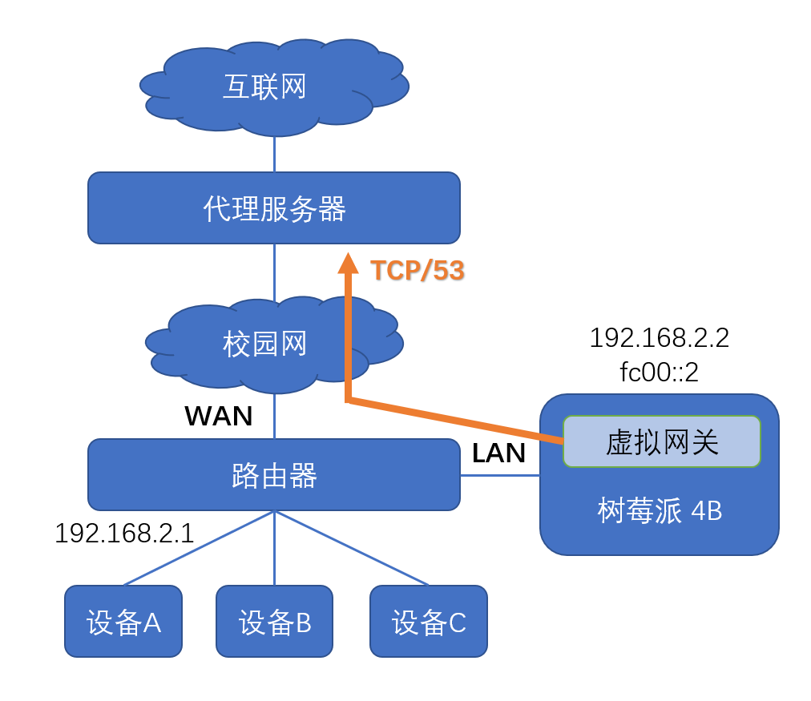

## 使用XProxy绕过校园网认证登录

部分校园网在登录认证时需要 DNS 解析，因而在防火墙上允许 `TCP/53` 或 `UDP/53` 端口通行，借助这个漏洞，可将内网流量用 XProxy 代理并转发到公网服务器上，实现免认证、无限速的上网。

以下为一般情况下的网络拓扑：



为了方便讲解，我们假设以下典型情况：

+ 校园网交换机无IPv6支持，同时存在QoS

+ 无认证时允许53端口通行，ICMP流量无法通过

+ 使用三台公网服务器负载均衡，其53端口上运行有代理服务

+ 三台服务器只有一台支持 IPv4 与 IPv6 双栈，其余只支持 IPv4

### 代理协议

首先，从速度上考虑，我们应该选用socks层面的代理，它在代理服务器上的部署更方便，且CPU负载较低，缺点则是ICMP流量无法被代理，不过绝大多数情况下并不会用到公网ICMP流量（例如PING命令）；其次，由于存在高峰期QoS，应使用基于TCP的代理协议，此外，为了避开校园网的流量审查，我们应该将流量加密传输；最后，由于软路由性能一般较差，而代理服务器无需考虑协议兼容性问题，我们可以考虑基于 XTLS 的传输方式，它可以显著降低代理 https 流量时的性能开销。

综上，选择 VLESS + XTLS 或者 Trojan + XTLS 代理是当前网络环境下的最优解。

### 初始化配置

> 分配 `192.168.2.0/24` 和 `fc00::/64` 给内网使用

路由器 WAN 口接入学校交换机，构建一个 NAT 转换，代理流量在路由器转发后送到公网服务器的53端口上；假设内网中路由器地址为 `192.168.2.1` ，配置虚拟网关 IPv4 地址为 `192.168.2.2` ，IPv6 地址为 `fc00::2` ；在网关中，无论 IPv4 还是 IPv6 流量都会被透明代理，由于校园网无 IPv6 支持，数据被封装后只通过 IPv4 网络发送，代理服务器接收以后再将其解开，对于 IPv6 流量，这里相当于一个 6to4 隧道。

```
# 宿主机网卡假定为 eth0
shell> ip link set eth0 promisc on
shell> modprobe ip6table_filter
shell> docker network create -d macvlan \
  --subnet=192.168.2.0/24 \  # 此处指定的参数为容器的默认网络配置
  --gateway=192.168.2.1 \
  --subnet=fc00::/64 \
  --gateway=fc00::1 \
  --ipv6 -o parent=eth0 macvlan
```

我们将配置文件保存在 `/etc/scutweb` 目录下，使用以下命令开启 XProxy 服务：

```
shell> docker run --restart always \
  --privileged --network macvlan -dt \
  --name scutweb --hostname scutweb \
  --volume /etc/scutweb/:/xproxy/ \
  --volume /etc/timezone:/etc/timezone:ro \
  --volume /etc/localtime:/etc/localtime:ro \
  dnomd343/xproxy:latest
```

### 参数配置

我们将三台服务器分别称为 `nodeA` ，`nodeB` 与 `nodeC` ，其中只有 `nodeC` 支持IPv6网络；此外，我们在内网分别暴露3个 socks 服务端口，用于检测三台服务器的可用性。

由于校园网无 IPv6 支持，这里 IPv6 上游网关可以不填写；虚拟网关对内网发布 RA 通告，让内网设备使用 SLAAC 配置网络地址，同时将其作为 IPv6 网关；此外，如果路由器开启了 DHCP 服务，需要将默认网关改为 `192.168.2.2` ，也可以启用 XProxy 自带的 DHCPv4 服务。

最后，由于我们代理全部流量，无需根据域名或者 IP 进行任何分流，因此路由资源自动更新部分可以省略。

修改 `xproxy.yml` ，写入以下配置：

```yaml
proxy:
  log: warning
  core: xray
  socks:
    nodeA: 1081
    nodeB: 1082
    nodeC: 1083

network:
  dns:
    - 192.168.2.1
  ipv4:
    gateway: 192.168.2.1
    address: 192.168.2.2/24
  ipv6:
    gateway: null
    address: fc00::2/64
  bypass:
    - 169.254.0.0/16
    - 224.0.0.0/3
    - fc00::/7
    - fe80::/10
    - ff00::/8

radvd:
  log: 5
  enable: true
  option:
    AdvSendAdvert: on
  prefix:
    cidr: fc00::/64

custom:
  - "iptables -t nat -N FAKE_PING"
  - "iptables -t nat -A FAKE_PING -j DNAT --to-destination 192.168.2.2"
  - "iptables -t nat -A PREROUTING -i eth0 -p icmp -j FAKE_PING"
  - "ip6tables -t nat -N FAKE_PING"
  - "ip6tables -t nat -A FAKE_PING -j DNAT --to-destination fc00::2"
  - "ip6tables -t nat -A PREROUTING -i eth0 -p icmp -j FAKE_PING"
```

在开始代理前，我们使用 `custom` 注入了一段脚本配置：由于这里我们只代理 TCP 与 UDP 流量，ICMP 数据包不走代理，内网设备 ping 外网时会一直无响应，加入这段脚本可以创建一个 NAT，假冒远程主机返回成功回复，但实际上 ICMP 数据包并未实际到达，效果上表现为 ping 成功且延迟为内网访问时间。

> 这段脚本并无实质作用，只是演示 `custom` 功能

### 代理配置

接下来，我们应该配置出站代理，修改 `config/outbounds.json` 文件，填入公网代理服务器参数：

```json
{
  "outbounds": [
    {
      "tag": "nodeA",
      ···
    },
    {
      "tag": "nodeB",
      ···
    },
    {
      "tag": "nodeC",
      ···
    },
  ]
}
```

接着配置路由部分，让暴露的三个 socks5 接口对接到三台服务器上，并分别配置IPv4与IPv6的负载均衡；路由核心在这里接管所有流量，IPv4 流量应将随机转发到三台服务器，而 IPv6 流量只送往 `nodeC` 服务器；创建 `config/routing.json` 文件，写入以下配置：

```json
{
  "routing": {
    "domainStrategy": "AsIs",
    "rules": [
      {
        "type": "field",
        "inboundTag": ["nodeA"],
        "outboundTag": "nodeA"
      },
      {
        "type": "field",
        "inboundTag": ["nodeB"],
        "outboundTag": "nodeB"
      },
      {
        "type": "field",
        "inboundTag": ["nodeC"],
        "outboundTag": "nodeC"
      },
      {
        "type": "field",
        "ip": ["0.0.0.0/0"],
        "balancerTag": "ipv4"
      },
      {
        "type": "field",
        "ip": ["::/0"],
        "balancerTag": "ipv6"
      }
    ],
    "balancers": [
      {
        "tag": "ipv4",
        "selector": [ "nodeA", "nodeB", "nodeC" ]
      },
      {
        "tag": "ipv6",
        "selector": [ "nodeC" ]
      }
    ]
  }
}
```

重启 XProxy 容器使配置生效：

```
shell> docker restart scutweb
```

最后，验证代理服务是否正常工作，若出现问题可以查看 `/etc/scutweb/log` 文件夹下的日志，定位错误原因。
